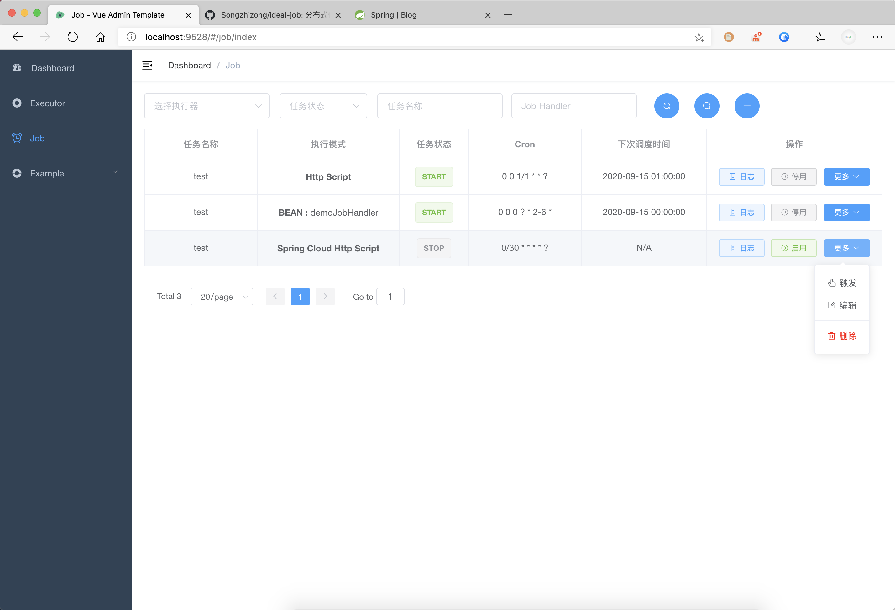

<a href="https://github.com/Songzhizong/ideal-job/"><strong>-- Home Page --</strong></a>

    
    
    
    

## 介绍

ideal-job是一个分布式任务调度系统，其设计目标是简单可靠、易于上手、能够以低耦合的方式与业务系统进行集成。

**本工程仅包含后端服务模块，前端管理页面见 [ideal-job-web](#https://github.com/Songzhizong/ideal-job-web)。**

### 页面预览

**调度器管理页面**

**任务管理页面**

## 软件架构

**部署方式**

调度器支持单点和集群方式部署。

**数据存储**

元数据存储在关系型数据库中。

**客户端接入**

提供java sdk，通过Rsocket与调度器集群建立长连接。

**消息可靠性**

集群内部维护客户端注册表，只要客户端连接到任意一个集群节点便可保障消息不丢失。

**服务性能**

调度器采用reactive stream技术栈，除数据库操作(默认JPA模式下，后续考虑引入R2DBC)外均为异步IO，可保证服务器资源最大化利用。

## 特性

- 简单易用的web管理系统。
- 功能丰富的openAPI，采用HTTP对外提供服务（提供Java SDK）。可通过接口对任务进行管理，方便业务系统无缝集成。

## 安装教程

1.  将代码clone到本地。
2.  修改ideal-job-scheduler-server模块下配置文件的数据库和redis配置。
3.  maven打包通过java命令运行，也可在IDE中直接运行。

> **注意：** 服务端需要监听两个端口，他们分别是：
>
> - `server.por`  http服务端口，对外提供任务管理功能。
> - `spring.rsocket.server.port`  roskcet监听端口，客户端通过此端口与调度器建立连接。

## 使用说明

> 详细的WEB操作说明见 [ideal-job-web](#https://github.com/Songzhizong/ideal-job-web)。

1.  xxxx
2.  xxxx
3.  xxxx

## TODO

- [ ] 添加WEB管理页面
- [ ] 添加任务执行日志采集功能
